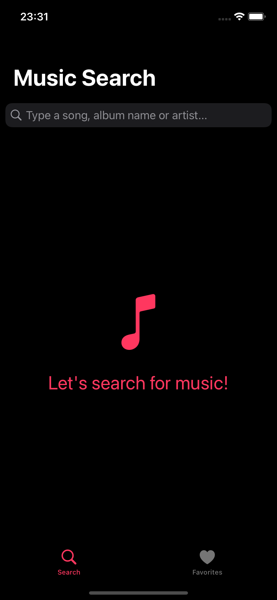

<!-- TITLE -->
<h1 align="center">Music Search App </h1>

- [About the Project](#about-the-project)  
- [Visual](#visual)
  - [Light Mode](#light-mode)
  - [Dark Mode](#dark-mode)
---

## About the project 

This is an iOS App for searching songs using the [iTunes Search API](https://affiliate.itunes.apple.com/resources/documentation/itunes-store-web-service-search-api/).

Built in Xcode 13 and it targets iOS 15.0.
Using:
- SwiftUI
- Combine
- MVVM

## Visual:
### Light Mode:

### Dark Mode:

